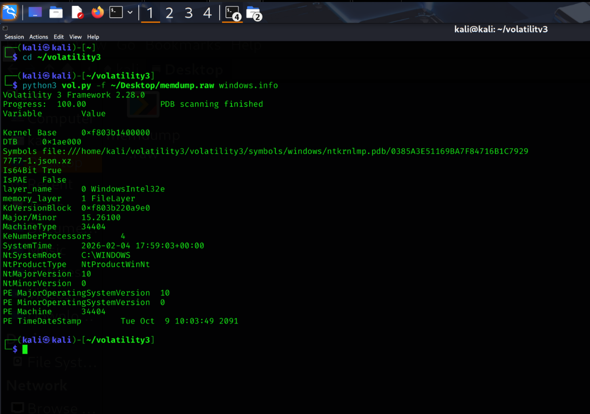
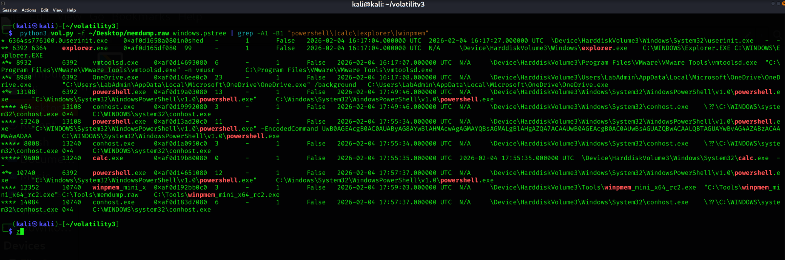
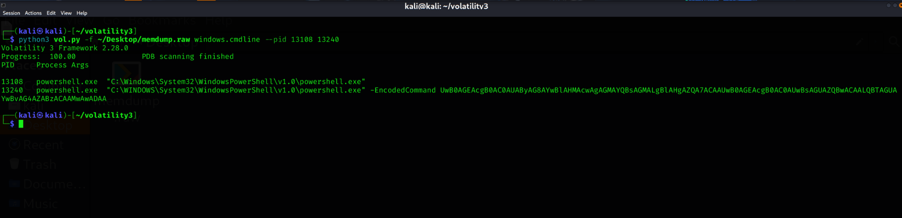
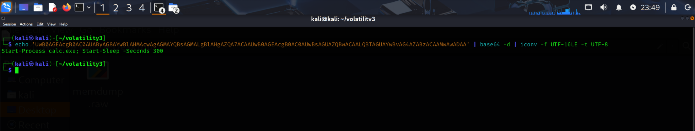
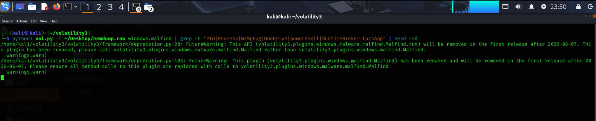

# Detecting Encoded PowerShell Execution with Memory Forensics

**Author:** Benjamin Mangus
**Date:** February 7, 2026
**Lab Environment:** SEC_LAB Home Lab

## Executive Summary

Simulated a malicious PowerShell attack on a domain-joined Windows 11 workstation using Base64-encoded commands (`-EncodedCommand`). A memory dump was captured with WinPMEM and analyzed on Kali Linux using Volatility 3. The investigation successfully identified the malicious process chain, decoded the obfuscated payload, triaged code injection findings (true vs. false positives), and reconstructed the full attack timeline.

**Key Results:**
- Decoded Base64 payload: `Start-Process calc.exe; Start-Sleep -Seconds 300`
- Identified malicious process chain: explorer -> powershell -> powershell -> calc.exe
- Triaged 7 malfind hits: 2 true positives, 1 expected, 4 false positives
- MITRE ATT&CK techniques T1059.001 (PowerShell) and T1027 (Obfuscation) mapped

## Lab Environment

| Host | IP Address | Role | OS |
|------|-----------|------|-----|
| DC01 | 10.0.0.5 | Domain Controller | Windows Server 2022 |
| WS01 | 10.0.0.16 | Target Workstation | Windows 11 Pro |
| Kali | 10.0.0.10 | Analysis Box | Kali Linux |
| Wazuh | 10.0.0.13 | SIEM / Log Collector | Ubuntu 22.04 |

**Network:** VMware NAT (10.0.0.0/24)
**Domain:** lab.local
**Analysis Tool:** Volatility 3 Framework v2.28.0
**Acquisition Tool:** WinPMEM (winpmem_mini_x64)
**Memory Dump Size:** 9 GB

## Attack Simulation

### Objective

Simulate an obfuscated PowerShell attack to create memory artifacts for forensic analysis.

### Tools Used

- **PowerShell** - `-EncodedCommand` for Base64-encoded payload delivery
- **WinPMEM** - RAM acquisition while malicious processes were running

### Attack Execution

```powershell
# Step 1: Open interactive PowerShell on WS01

# Step 2: Execute encoded payload from within PowerShell
powershell.exe -EncodedCommand UwB0AGEAcgB0AC0AUAByAG8AYwBlAHMAcwAgAGMAYQBsAGMALgBlAHgAZQA7ACAAUwB0AGEAcgB0AC0AUwBsAGUAZQBwACAALQBTAGUAYwBvAG4AZABzACAAMwAwADAA
```

### Decoded Payload

```powershell
Start-Process calc.exe; Start-Sleep -Seconds 300
```

This is a classic attacker proof-of-concept: launch a visible application (calc) to prove code execution, then sleep 5 minutes to keep the process alive.

### Memory Acquisition

```powershell
# Step 3: Capture memory while attack is still running
.\winpmem_mini_x64.exe memdump.raw
```

## Forensic Analysis

### System Identification

```bash
python3 vol.py -f memdump.raw windows.info
```

| Field | Value | Significance |
|-------|-------|-------------|
| `Major/Minor` | 15.26100 | Windows 11 (Build 26100) |
| `Is64Bit` | True | 64-bit system |
| `SystemTime` | 2026-02-04 17:59:03 UTC | Time of memory capture |
| `NtSystemRoot` | C:\WINDOWS | Standard Windows install |
| `KeNumberProcessors` | 4 | 4 CPU cores |

### Process Analysis

```bash
python3 vol.py -f memdump.raw windows.pslist
```

With 130+ processes running, the following stood out as anomalous:

| PID | PPID | Process | Created (UTC) | Anomaly |
|-----|------|---------|---------------|---------|
| 13108 | 6392 | powershell.exe | 17:49:46 | Interactive session from explorer.exe |
| 13240 | 13108 | powershell.exe | 17:55:34 | **Child PS spawned by first PS** |
| 9600 | 13240 | calc.exe | 17:55:35 | **Spawned by nested PS, exited instantly** |
| 12352 | 10740 | winpmem_mini_x | 17:59:03 | Memory acquisition tool (expected) |

### Process Tree Analysis

```bash
python3 vol.py -f memdump.raw windows.pstree
```

The process tree revealed a clear attack chain:

```
explorer.exe (PID 6392)                    ← User session
├── powershell.exe (PID 13108)             ← Attacker's interactive session
│   └── powershell.exe (PID 13240)         ← Encoded command execution
│       └── calc.exe (PID 9600) [EXITED]   ← Proof-of-concept payload
├── powershell.exe (PID 10740)             ← Analyst's acquisition session
│   └── winpmem_mini_x (PID 12352)         ← Memory dump tool
└── SecurityHealthSystray (PID 8860)
```

**Why this is suspicious:**
- PowerShell spawning another PowerShell is a common staging pattern
- The child PowerShell used `-EncodedCommand` (obfuscation)
- calc.exe spawning from PowerShell and immediately exiting is a classic PoC indicator

### Command-Line Extraction

```bash
python3 vol.py -f memdump.raw windows.cmdline --pid 13108 13240
```

**PID 13108 (Parent PowerShell):**
```
"C:\Windows\System32\WindowsPowerShell\v1.0\powershell.exe"
```
A standard interactive session - no arguments, launched manually.

**PID 13240 (Child PowerShell):**
```
"C:\WINDOWS\System32\WindowsPowerShell\v1.0\powershell.exe" -EncodedCommand
UwB0AGEAcgB0AC0AUAByAG8AYwBlAHMAcwAgAGMAYQBsAGMALgBlAHgAZQA7ACAA
UwB0AGEAcgB0AC0AUwBsAGUAZQBwACAALQBTAGUAYwBvAG4AZABzACAAMwAwADAA
```

### Payload Decoding

```bash
echo '<base64_string>' | base64 -d | iconv -f UTF-16LE -t UTF-8
```

**Result:** `Start-Process calc.exe; Start-Sleep -Seconds 300`

### Code Injection Analysis (Malfind)

```bash
python3 vol.py -f memdump.raw windows.malfind
```

The `malfind` plugin identifies memory regions with `PAGE_EXECUTE_READWRITE` (RWX) protection not backed by a file on disk - a common indicator of code injection.

| PID | Process | Verdict | Reasoning |
|-----|---------|---------|-----------|
| 3296 | MsMpEng.exe | **False Positive** | Windows Defender JIT engine uses RWX memory |
| 8980 | OneDrive.exe | **False Positive** | .NET applications use RWX for JIT compilation |
| 13108 | powershell.exe | **True Positive** | Malicious interactive session with suspicious children |
| 13240 | powershell.exe | **True Positive** | Encoded command executor |
| 10740 | powershell.exe | **Expected** | Used for memory acquisition with WinPMEM |
| 11592 | RuntimeBroker.exe | **False Positive** | Normal Windows UWP broker |
| 11908 | LockApp.exe | **False Positive** | Normal Windows lock screen component |

### MITRE ATT&CK Mapping

| Technique ID | Name | Tactic | Description |
|-------------|------|--------|-------------|
| T1059.001 | Command and Scripting Interpreter: PowerShell | Execution | PowerShell used to execute encoded commands |
| T1027 | Obfuscated Files or Information | Defense Evasion | Base64 encoded PowerShell payload |
| T1106 | Native API | Execution | `Start-Process` cmdlet used to spawn calc.exe |

## Key Findings

1. **Encoded payload recovered from memory** - Base64-encoded PowerShell command decoded to `Start-Process calc.exe; Start-Sleep -Seconds 300`
2. **Process chain identified** - explorer.exe -> powershell.exe -> powershell.exe -> calc.exe
3. **False positive triage** - 4 of 7 malfind hits were false positives from legitimate Windows processes (Defender, OneDrive, RuntimeBroker, LockApp)
4. **Attack timeline reconstructed** - 6-minute window between initial access (17:49) and memory capture (17:59)
5. **No network connections found** - `windows.netscan` returned empty (known Windows 11 limitation in Volatility 3)

### Indicators of Compromise (IOCs)

| IOC Type | Value | Context |
|----------|-------|---------|
| Process Chain | explorer -> powershell -> powershell | Nested PowerShell staging |
| Command-Line | `-EncodedCommand` | Base64 obfuscation technique |
| Decoded Payload | `Start-Process calc.exe` | Proof-of-concept execution |
| PID | 13108, 13240 | Malicious PowerShell processes |
| Memory | PAGE_EXECUTE_READWRITE | RWX regions in PowerShell processes |

## Recommendations

### Immediate Mitigations

1. **Enable PowerShell Script Block Logging**
   - Group Policy: Computer Configuration > Administrative Templates > Windows Components > Windows PowerShell > Turn on Script Block Logging
   - Captures decoded commands regardless of obfuscation

2. **Enable Process Creation Auditing**
   - Group Policy: Audit Process Creation (Event ID 4688) with command-line logging
   - Captures `-EncodedCommand` in Sysmon/Windows events

3. **Monitoring & Alerting**
   - Alert on `-EncodedCommand` in process creation events
   - Alert on PowerShell spawning child PowerShell processes
   - Monitor for unusual parent-child process relationships

### Long-term Recommendations

1. **Deploy Sysmon** for detailed process creation logging with command-line capture
2. **Constrained Language Mode** - Restrict PowerShell to limit script execution
3. **Application Whitelisting** - Prevent unauthorized executables from running
4. **Regular memory analysis** - Periodically capture and analyze endpoint memory for threats

## Volatility 3 Command Reference

```bash
# System identification
python3 vol.py -f memdump.raw windows.info

# List all processes
python3 vol.py -f memdump.raw windows.pslist

# Process tree (parent-child relationships)
python3 vol.py -f memdump.raw windows.pstree

# Command-line arguments for specific PIDs
python3 vol.py -f memdump.raw windows.cmdline --pid 13108 13240

# Code injection detection
python3 vol.py -f memdump.raw windows.malfind

# Network connections (may be empty on Win11)
python3 vol.py -f memdump.raw windows.netscan
```

## Lessons Learned

1. **Memory forensics captures what disk forensics misses** - The encoded PowerShell command was visible in memory even though it left minimal disk artifacts
2. **Process trees are powerful** - The parent-child relationship immediately highlighted the attack chain
3. **Always decode `-EncodedCommand`** - One of the most common obfuscation techniques and trivial to reverse
4. **Triage malfind results carefully** - False positives are common; correlate with process context and command lines

## Screenshots

1. Volatility `windows.info` output showing Windows 11 identification


2. Process list (`windows.pslist`) highlighting suspicious PowerShell processes


3. Process tree (`windows.pstree`) showing the attack chain


4. Command-line extraction (`windows.cmdline`) showing the encoded payload


5. Base64 decoding revealing the payload


6. Malfind results showing RWX memory regions


## References

- [MITRE ATT&CK T1059.001 - PowerShell](https://attack.mitre.org/techniques/T1059/001/)
- [MITRE ATT&CK T1027 - Obfuscated Files or Information](https://attack.mitre.org/techniques/T1027/)
- [Volatility 3 Documentation](https://volatility3.readthedocs.io/)
- [WinPMEM Memory Acquisition](https://github.com/Velocidex/WinPmem)
